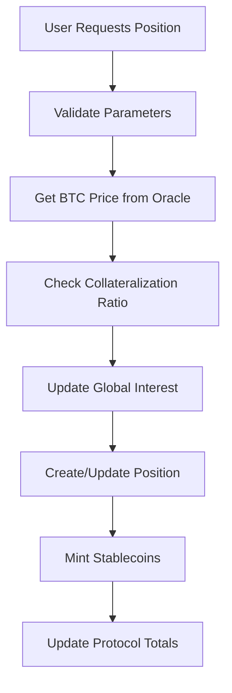
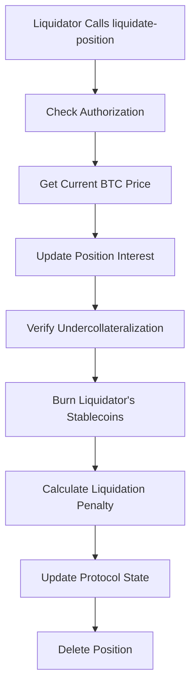
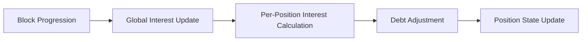

# StacksVault Protocol

> **Decentralized BTC-Collateralized Stablecoin Lending Protocol on Stacks Layer 2**

StacksVault enables users to mint USD-pegged stablecoins by depositing Bitcoin as collateral, providing a secure and decentralized lending solution built on the Stacks blockchain.

## 🚀 Features

- **Bitcoin-Collateralized Lending**: Mint stablecoins using BTC as collateral
- **Over-Collateralization**: 150% minimum collateral ratio ensures protocol stability
- **Automated Liquidations**: 120% liquidation threshold with 10% penalty for risk management
- **Dynamic Interest Rates**: ~10% APR with block-based interest accrual
- **Oracle Integration**: Real-time BTC price feeds with 24-hour expiry validation
- **Emergency Controls**: Protocol pause functionality for security
- **Transparent Governance**: Administrative functions with ownership controls

## 📋 System Overview

StacksVault operates as a collateralized debt position (CDP) system where users lock Bitcoin to mint stable USD tokens. The protocol maintains stability through over-collateralization requirements and automated liquidation mechanisms.

### Key Parameters

| Parameter | Value | Description |
|-----------|-------|-------------|
| Minimum Collateral Ratio | 150% | Required collateralization for new positions |
| Liquidation Threshold | 120% | Collateral ratio triggering liquidation |
| Liquidation Penalty | 10% | Fee charged during liquidation |
| Minimum Loan | 100 USD | Smallest debt position allowed |
| Interest Rate | ~10% APR | Dynamic rate calculated per block |
| Price Expiry | 24 hours | Oracle price data validity period |

## 🏗️ Contract Architecture

### Core Components

```
StacksVault Protocol
├── Administrative Layer
│   ├── Protocol Owner Management
│   ├── Emergency Pause Controls
│   └── Oracle Price Updates
├── Position Management
│   ├── Create/Expand Positions
│   ├── Collateral Management
│   └── Debt Repayment
├── Risk Management
│   ├── Collateralization Checks
│   ├── Liquidation Engine
│   └── Interest Accrual System
└── Query Interface
    ├── Position Status
    ├── Protocol Statistics
    └── Collateralization Ratios
```

### Data Structures

**Position Mapping**

```clarity
{
  collateral: uint,        // BTC amount in satoshis
  debt: uint,             // Stablecoin debt amount
  last-update-block: uint // Last interest calculation block
}
```

**Protocol State Variables**

- `total-debt`: Aggregate system debt
- `total-collateral`: Total BTC locked
- `stability-fee`: Accumulated protocol fees
- `btc-price-in-usd`: Oracle price data with timestamp

## 🔄 Data Flow

### Position Creation Flow



### Liquidation Flow



### Interest Accrual System



## 📖 Core Functions

### User Functions

**Position Management**

- `create-position(btc-amount, stable-amount)` - Create or expand a collateralized position
- `add-collateral(btc-amount)` - Add additional BTC collateral
- `withdraw-collateral(btc-amount)` - Remove excess collateral (if safely collateralized)
- `repay-debt(amount)` - Repay stablecoin debt (partial or full)

**Liquidation**

- `liquidate-position(user)` - Liquidate undercollateralized positions

### Administrative Functions

**Protocol Management**

- `set-protocol-owner(new-owner)` - Transfer protocol ownership
- `pause-protocol(paused)` - Emergency pause/unpause
- `update-btc-price(price, timestamp)` - Update oracle price data

### Query Functions

**Position Queries**

- `get-position(user)` - Retrieve user position details
- `get-collateralization-ratio(user)` - Calculate position safety ratio
- `get-protocol-stats()` - Comprehensive protocol statistics

## 🛡️ Security Features

### Risk Management

- **Over-Collateralization**: 150% minimum ratio prevents undercollateralization
- **Liquidation Mechanism**: Automated liquidation at 120% ratio
- **Price Oracle Validation**: 24-hour price expiry prevents stale data usage
- **Interest Accrual**: Real-time debt growth prevents arbitrage

### Access Controls

- **Owner-Only Functions**: Critical operations restricted to protocol owner
- **Emergency Pause**: Immediate protocol shutdown capability
- **Self-Liquidation Prevention**: Users cannot liquidate their own positions

### Economic Security

- **Liquidation Incentives**: 10% penalty rewards liquidators
- **Minimum Position Size**: 100 USD minimum prevents dust attacks
- **Dynamic Interest**: Block-based accrual ensures fair debt growth

## 🚦 Usage Examples

### Creating a Position

```clarity
;; Deposit 1 BTC (100M satoshis) to mint 30,000 USD stablecoins
(contract-call? .stacksvault create-position u100000000 u3000000000000)
```

### Adding Collateral

```clarity
;; Add 0.5 BTC additional collateral
(contract-call? .stacksvault add-collateral u50000000)
```

### Repaying Debt

```clarity
;; Repay 10,000 USD worth of debt
(contract-call? .stacksvault repay-debt u1000000000000)
```

### Checking Position

```clarity
;; View position details
(contract-call? .stacksvault get-position 'SP2X0TZ59D5SZ8ACQ6YMCHHNR2ZN51Z32E2CJ173)
```

## ⚠️ Risk Considerations

- **Price Volatility**: Bitcoin price fluctuations affect collateral value
- **Liquidation Risk**: Positions below 120% ratio face liquidation
- **Interest Accumulation**: Debt grows over time through interest
- **Oracle Dependency**: Relies on accurate and timely price feeds
- **Smart Contract Risk**: Protocol subject to potential contract vulnerabilities

## 🔮 Protocol Statistics

Monitor protocol health through key metrics:

- **Total Value Locked (TVL)**: Bitcoin collateral value
- **Outstanding Debt**: Total stablecoins minted
- **Collateralization Ratio**: System-wide safety margin
- **Liquidation Events**: Risk management effectiveness

## 📄 License

MIT License - see LICENSE file for details.

## 🤝 Contributing

StacksVault Protocol is open for community contributions. Please follow the contribution guidelines and ensure all changes maintain protocol security and stability.
